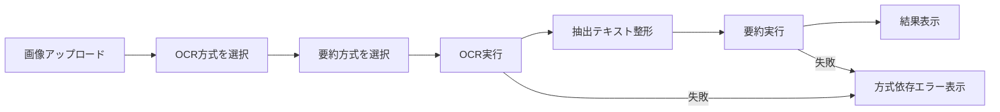

# 画像要約アプリ 要件定義 v0.2

## 1. Problem Statement

本アプリは、給与明細、帳票、申込書、スクリーンショット等の画像から、
テキストを抽出し、内容を整形して要点を要約するための Web アプリケーションである。

従来の実装は OpenAI API を前提にした単一路線で構成されていたが、
利用シーンによっては以下の課題がある。

- クラウド API に依存するため、オフラインまたはローカル完結要件に対応できない
- 文書種別によって OCR の得意不得意が異なり、単一エンジンでは精度が安定しない
- OCR と要約の実行方式を一体化しているため、用途別の切り替えがしにくい

そのため本アプリでは、OCR と要約を分離したうえで、複数の実行方式を切り替え可能にし、
用途に応じて精度、コスト、処理速度、外部依存のバランスを選択できることを目指す。

## 2. Scope

### 2.1 In Scope

- 画像ファイルのアップロード
- OCR 方式の選択
- 要約方式の選択
- 選択方式に応じたバックエンド処理の切り替え
- 抽出テキストの整形
- 要約結果の画面表示
- エラー時のユーザー向けフィードバック
- OCR / 要約方式ごとの前提条件と制約の明示

### 2.2 Out of Scope

- ユーザー認証
- 要約結果の永続保存
- 権限管理
- PDF の正式対応
- 複数 OCR 結果の高度な自動アンサンブル統合
- 文書種別ごとの専用ルールベース抽出
- 業務システムとの連携

### 2.3 Phased Delivery

#### Phase 1: 切替可能な基盤整備

- OCR 方式を 3 種類から選択できる
- 要約方式を 2 種類から選択できる
- 各方式を独立に実行できる
- UI 上で方式を明示的に切り替えられる

#### Phase 2: 高精度モード整備

- `NDLOCR-Lite` を活用した文書向け高精度 OCR モードを提供する
- `Ollama` を用いたローカル OCR / ローカル要約を正式対応とする
- `high_accuracy` は `NDLOCR-Lite` を主 OCR とする正式モードとして固定する
- Phase 2 では自動フォールバックではなく、選択モードを尊重して明示エラーを返す
- 必要に応じて LLM による後処理を内部実装として追加可能にする

#### Phase 3: 推奨制御と高度化

- 入力画像の性質に応じた方式の推奨表示
- 文書種別に応じた既定モード最適化
- 将来的な複数結果統合の検討

## 3. Constraints / Assumptions

### 3.1 技術前提

- フロントエンドは Next.js + TypeScript を継続利用する
- バックエンドは FastAPI を継続利用する
- 既存の OpenAI API ベース実装は後方互換のある形で維持する
- ローカル実行方式では Ollama を利用する
- 文書 OCR エンジンとして `C:\Users\ryo-n\Codex_dev\ndlocr-lite` を組み込み候補とする

### 3.2 実行環境前提

- OpenAI API 利用時は API キーが設定されていること
- Ollama 利用時は Ollama サーバが起動していること
- Ollama 利用時は対象マルチモーダルモデルが事前取得済みであること
- `NDLOCR-Lite` 利用時はローカル実行に必要な Python 環境と依存関係が整備されていること

### 3.3 品質前提

- OCR 結果は完全一致を保証しない
- 要約結果は参考情報として扱い、重要判断の最終責任はユーザーが持つ
- 不明瞭な情報は断定せず、不確実なまま扱う

### 3.4 UX 前提

- 利用者が技術的背景を知らなくても方式を選べるようにする
- ただし、各方式の特徴と制約は UI 上で説明可能にする
- ラジオボタンは 1 系統ではなく、OCR 方式と要約方式を分離して提供する
- フロントエンドの見た目は青と白を主配色とし、清潔感と信頼感のあるモダンな印象を持たせる

## 4. Roles of Each Engine

### 4.1 OCR 方式

#### A. API OCR モード

- OpenAI API を用いて画像からテキストを抽出する
- クラウド依存だが、汎用性が高い
- スクリーンショットや半構造文書に対して広く適用する

#### B. ローカル LLM OCR モード

- Ollama 上のマルチモーダル LLM を用いて OCR を行う
- ローカル完結を優先するケースを対象とする
- API 非依存だが、モデル性能やマシンスペックの影響を受ける

#### C. 高精度 OCR モード

- `NDLOCR-Lite` を用いて文書画像のテキスト抽出を行う
- 帳票、紙文書、印刷物など日本語文書向けの精度向上を狙う
- Phase 2 の正式定義では `NDLOCR-Lite` を主 OCR とし、抽出結果は既存正規化層へ渡す
- LLM 後処理は `summary_mode=local_llm` のときに整形・要約段で活用できるが、OCR エンジン自体は `NDLOCR-Lite` として扱う
- この段階では複数 OCR 結果の完全統合までは行わない

### 4.2 要約 / 整形方式

#### A. API 要約モード

- OpenAI API を用いて抽出テキストを整形・要約する
- 既存の要約品質を継承しやすい
- クラウド利用を前提とする

#### B. ローカル LLM 要約モード

- Ollama 上のローカル LLM を用いて整形・要約する
- ローカル完結を優先するケースに対応する
- モデルごとに品質差があるため、結果の一貫性には注意が必要

## 5. Functional Requirements

### 5.1 画面要件

画面には少なくとも以下を表示する。

- タイトル
- 画像ファイル選択 UI
- OCR 方式選択ラジオボタン
- 要約方式選択ラジオボタン
- 各方式の説明文または補助テキスト
- 実行ボタン
- ローディング表示
- エラーメッセージ表示領域
- 要約結果表示領域
- 任意で抽出テキスト表示領域
- 青と白を基調にした一貫したビジュアルデザイン
- カードと余白を活用したモダンな情報整理

### 5.2 モード選択要件

ユーザーは OCR 方式として以下を選択できること。

- `API OCR`
- `ローカル LLM OCR`
- `高精度 OCR (NDLOCR-Lite)`

ユーザーは要約方式として以下を選択できること。

- `API 要約`
- `ローカル LLM 要約`

### 5.3 モード組み合わせ要件

システムは以下の組み合わせを許容すること。

- `API OCR` + `API 要約`
- `API OCR` + `ローカル LLM 要約`
- `ローカル LLM OCR` + `API 要約`
- `ローカル LLM OCR` + `ローカル LLM 要約`
- `高精度 OCR` + `API 要約`
- `高精度 OCR` + `ローカル LLM 要約`

### 5.4 入力要件

- 対応入力は画像ファイルとする
- MVP では JPG / JPEG / PNG を正式対象とする
- 将来的な TIFF / BMP / JP2 等は拡張扱いとする
- 空ファイルは拒否する
- サイズ上限は実装側で定義する

### 5.5 OCR 処理要件

- 選択された OCR 方式に応じて抽出処理を切り替える
- OCR 結果が空または実質空の場合はエラーまたは警告を返す
- 文書系画像では `高精度 OCR` を推奨できる設計とする
- `high_accuracy` 選択時は `NDLOCR-Lite` を必ず経由し、内部で別 OCR へ自動切替しない
- `local_llm` 選択時は Ollama のマルチモーダルモデルを利用し、未起動や未設定時は明示エラーとする

### 5.6 要約処理要件

- 抽出テキストに対して整形処理を実施できること
- 整形後テキストから要約文を生成できること
- 可能であれば文書種別、対象期間、主要項目を保持すること
- 不明な項目は断定しないこと
- `summary_mode=local_llm` は Ollama のテキスト系またはマルチモーダル系モデルを用いて整形・要約する
- Phase 2 ではローカル要約結果が厳密 JSON を返せない場合を許容し、後段で構造化整形する

### 5.7 結果表示要件

- 要約結果を日本語で表示する
- 必要に応じて抽出テキストを表示できる
- 警告や不明瞭情報を表示できる
- 将来的な構造化表示に拡張可能な設計にする

### 5.8 エラー処理要件

- ファイル未選択時は送信できない
- 処理中は二重送信を防止する
- 非対応形式はユーザーに明示する
- API 未設定、Ollama 未起動、ローカル OCR 実行不可など、方式依存の失敗理由を分かる形で返す
- Phase 2 の外部依存エラーでは、自動で別方式へ切り替えず、選択モードを保ったまま失敗理由を返す

## 6. Recommended UX Policy

### 6.1 利用者向け表示方針

UI 上の方式名称は、技術名だけでなく利用意図が分かる表現を併記する。

例:

- `標準 (API OCR)`
- `ローカル (Ollama OCR)`
- `高精度 (NDLOCR-Lite)`
- `クラウド要約 (API)`
- `ローカル要約 (Ollama)`

また、UI 全体は青と白を基調とし、業務利用でも違和感のないモダンで落ち着いた雰囲気を目指す。

### 6.2 推奨シナリオ

- スクリーンショット中心: `API OCR` を推奨
- クラウドを使いたくない: `ローカル LLM OCR` + `ローカル LLM 要約`
- 帳票 / 紙文書中心: `高精度 OCR` を推奨

## 7. I/O Contract

### 7.1 Input

入力は以下の情報から構成する。

- 画像ファイル
- OCR 方式
- 要約方式

例:

```json
{
  "ocrMode": "high_accuracy",
  "summaryMode": "local",
  "file": "salary-slip.png"
}
```

### 7.2 Output

出力は少なくとも以下を含む。

- 元ファイル名
- 抽出テキスト
- 要約文
- warnings
- 使用した OCR 方式
- 使用した要約方式

将来的には以下の構造化情報を含められることが望ましい。

- 文書種別
- 対象期間
- 詳細項目
- 不確実項目

## 8. Minimal Flow



## 9. Interfaces

### 9.1 フロントエンド

- 画像アップロード UI
- OCR 方式ラジオボタン
- 要約方式ラジオボタン
- 実行トリガー
- 結果表示領域

### 9.2 バックエンド

- 単一画像を処理する API
- OCR 方式と要約方式を受け取る API 契約
- OCR 実行層
- 整形層
- 要約実行層

### 9.3 内部インターフェース方針

- OCR 層はエンジン差し替え可能な抽象化を持つ
- 要約層は API / ローカル LLM の切り替え可能な抽象化を持つ
- `NDLOCR-Lite` は外部 CLI 連携またはライブラリ連携のいずれかで組み込める構造とする

## 10. Acceptance Criteria

- 利用者が OCR 方式を選択できる
- 利用者が要約方式を選択できる
- 選択された方式に応じて処理経路が切り替わる
- API ベース構成だけでも従来どおり動作する
- ローカル構成を選んだ際に、API キーなしで処理可能である
- `高精度 OCR` を選んだ際に `NDLOCR-Lite` が利用される
- 各失敗パターンで原因が分かるエラーを返せる
- `local_llm` 系モードでは `Ollama` 未起動 / モデル未設定 / タイムアウトを識別できる
- `high_accuracy` モードでは `NDLOCR-Lite` の未設定 / 実行失敗 / タイムアウトを識別できる
- `high_accuracy + local_llm` の組み合わせで、OCR と要約の責務が分離されている

## 11. Open Questions

- `Ollama` で採用する既定モデル名を何にするか
- `NDLOCR-Lite` の CLI 引数と出力形式の確定版をどこまで固定するか
- ローカル要約の `structuredData` 充足率をどの程度まで Phase 2 完了条件に含めるか

